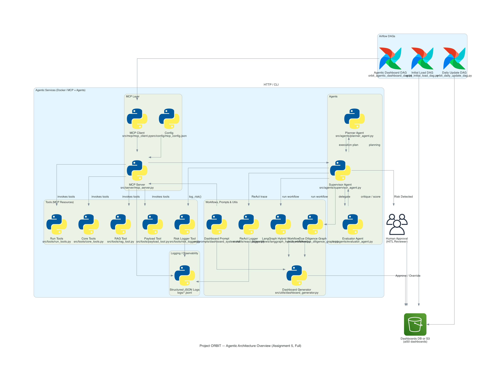

# 🚀 Project ORBIT — AI 50 Agentic Dashboard System
Automated RAG + Structured + MCP + Agentic Pipelines for Private-Equity Due Diligence Dashboards

---

# 🔍 Overview

Project ORBIT (Operational Research for Business Intelligence & Trends) is a cloud-native, fully automated analytics ecosystem designed to generate private-equity diligence dashboards for the Forbes AI 50 companies.

This v3 architecture integrates:

- Agentic multi-step workflows (HITL/AUTO-APPROVE review logic)
- MCP Server + MCP SDK clients for RAG + structured dashboard generation
- FastAPI backend exposing dashboard tools as MCP-compliant endpoints
- Streamlit dashboards for investor-facing UIs
- Pinecone vector DB for RAG semantic retrieval
- Instructor + OpenAI JSON mode for structured extraction
- GCS as the unified data lake
- Apache Airflow DAGs for automated ingestion, payload updates, risk detection
- Docker + Cloud Run / App Engine for scalable deployment
- Automated pytest suite (14/14 PASS) for full system validation

This system transforms raw web content → structured payloads → RAG context → validated Markdown PE dashboards.

---

# ⚙️ Environment Setup

```bash
git clone https://github.com/Big-Data-Team3/pe-dashboard-ai50-v3-team-3-BigData.git
cd pe-dashboard-ai50-v3-team-3-BigData
pip install -r requirements.txt
```

Create a `.env` file:

```
OPENAI_API_KEY=sk-xxxx
PINECONE_API_KEY=xxxx
PINECONE_ENV=us-east-1
PINECONE_INDEX=ai50-rag-index
GCS_BUCKET=us-central1-pe-dashboard-or-395f6975-bucket
GOOGLE_CLOUD_PROJECT=<your-project-id>
```

---

# ☁️ Core Technologies

| Layer | Technology |
|-------|------------|
| Backend | FastAPI, MCP Server |
| Frontend | Streamlit |
| LLM Ops | OpenAI (Chat Completions + Embeddings), Instructor |
| Vector DB | Pinecone (3072-D cosine) |
| Storage | GCS (raw → structured → payload) |
| Orchestration | Apache Airflow (Cloud Composer) |
| Deployment | Cloud Run, App Engine, Docker |
| Agent Framework | Custom MCP Client + Multi-node Agent Graph |

---

# 🔄 End-to-End Project Flow

## 1️⃣ Data Ingestion & Enrichment
- `lab1_scraper_payload_ready.py`  
- Scrapes About/Product/Careers/News pages  
- Saves raw HTML + cleaned text + metadata to GCS

## 2️⃣ RAG Index Pipeline
- `lab4_rag_index_builder_pinecone.py`  
- Chunks text → embeddings → uploads to Pinecone (3072-D)

## 3️⃣ Structured Extraction
- `lab5_structured_extraction.py`  
- Instructor + Pydantic models produce fully validated structure

## 4️⃣ Payload Assembly
- `lab6_build_payload.py`  
- Combines structured outputs into the final payload schema

## 5️⃣ FastAPI MCP Backend
Endpoints:
- `/tool/generate_structured_dashboard`
- `/tool/generate_rag_dashboard`
- `/resource/ai50/companies`
- `/prompt/pe-dashboard`

## 6️⃣ Agentic Workflow Graph
The workflow determines:
- AUTO_APPROVE vs HITL review  
- risk detection outcomes  
- execution order of dashboard pipelines  

## 7️⃣ Airflow Automation
- Daily ingestion  
- MCP-driven dashboard generation  
- RAG index refresh  
- Risk detection + event logging  

## 8️⃣ Streamlit UI
- Visual displays of company metrics  
- RAG dashboards + structured dashboards  
- Downloadable Markdown output  

---

# 🧱 Airflow DAGs

| DAG | Purpose |
|------|---------|
| `ai50_lab2_ingest_dag.py` | Full + daily scrape |
| `ai50_lab2_lab4_dag.py` | Clear + rebuild Pinecone RAG index |
| `orbit_agentic_dashboard_dag.py` | MCP-driven dashboard generator |
| `setup_playwright_dag.py` | Installs Chromium/Playwright in Composer |

---

# 🧭 Architecture Diagram




---

# 📸 Automated Testing (14/14 PASS)

A complete pytest suite covering:

- MCP tools  
- RAG search  
- Structured payload extraction  
- Agentic workflow branches  
- Risk detection  
- FastAPI endpoints  
- Mocked GCS + HTTPX behavior  

**Files:**
```
tests/TEST_REPORT.md
tests/test_report.png
```

All tests passed ✔

---

# 🚀 Live Deployment (Placeholders)

| Component | Platform | URL |
|-----------|----------|-----|
| RAG API | App Engine | https://<placeholder> |
| Structured API | App Engine | https://<placeholder> |
| Streamlit RAG UI | Cloud Run | https://<placeholder> |
| Streamlit Structured UI | Cloud Run | https://<placeholder> |

---

# 👥 Team Contributions (Equal ≈ 33%)

| Member | Contribution |
|-------|--------------|
| **Krittivasan Jagannathan** | FastAPI MCP server, RAG engine, Streamlit UI, deployment, test suite |
| **Sthavir Gokul Soroff** | Structured extraction, Pydantic payload assembly, DAG automation |
| **Pooja Subramanya Raghu** | Ingestion, Forbes enrichment, Composer DAG builds, UI & evaluation |

---

# 🗂 Repository Structure

```
pe-dashboard-ai50-v3-team-3-BigData/
├── dags/
│   ├── ai50_lab2_ingest_dag.py
│   ├── ai50_lab2_lab4_dag.py
│   ├── orbit_agentic_dashboard_dag.py
│   └── setup_playwright_dag.py
│
├── src/
│   ├── server/
│   ├── tools/
│   ├── workflows/
│   ├── mcp/
│   ├── utils/
│   └── prompts/
│
├── tests/
│   ├── test_lab15_mcp.py
│   ├── test_tools.py
│   ├── test_dashboard.py
│   ├── test_due_deligency_workflow.py
│   ├── test_payload_tool.py
│   ├── TEST_REPORT.md
│   └── test_report.png
│
├── Dockerfile
├── docker-compose.yaml
├── requirements.txt
└── README.md
```

---

# 🎥 Demo Video

> **PLACEHOLDER - Add YouTube video link here**  
Example: https://youtu.be/<video-id>

---

# 📘 Documentation (Codelab PDF)

> **PLACEHOLDER - Add Google Drive link here**  
Example: https://codelabs-preview.appspot.com/?file_id=1UMlptuSl0InsaMREQPsA2r7rf4qtVv87SexAiCtoWiM#0

---

# 🧾 Attestation

We confirm this work is original and complies with Northeastern University’s academic integrity guidelines.

Team 3 - Big Data  
Date: November 2025  
Northeastern University - Information Systems

---

# 🧠 Key Takeaway

This project demonstrates how AI-driven pipelines, retrieval, structured LLMs, and agentic workflows can automate private-equity intelligence at scale.
