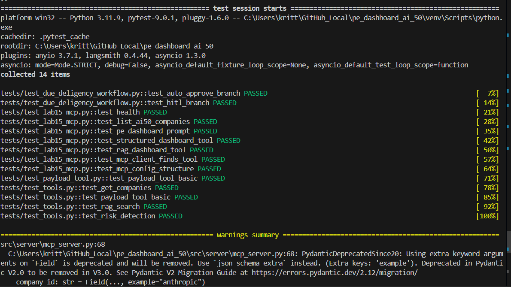

# 🧪 PE Dashboard AI-50 — Test Suite Report

This report summarizes the status of the full automated test suite for the **PE Dashboard AI-50** project.  
All tests were executed using `pytest -vv` inside the project’s virtual environment.

---

## ✔️ Test Environment

- **Platform:** Windows 11  
- **Python:** 3.11.9  
- **Pytest:** 9.0.1  
- **Async Mode:** STRICT  
- **Virtualenv:** Active (`venv`)  
- **Rootdir:** `pe_dashboard_ai_50`

---

## 📸 Test Run Screenshot

Below is the exact terminal output screenshot captured during the final successful run:

---

## ✅ Summary of Tests

A total of **14 tests** were collected and executed:

| Test File                         | Status  | Count |
|----------------------------------|---------|-------|
| `test_due_deligency_workflow.py` | PASSED  | 2     |
| `test_lab15_mcp.py`              | PASSED  | 7     |
| `test_payload_tool.py`           | PASSED  | 1     |
| `test_tools.py`                  | PASSED  | 4     |
| **Total**                         | **PASSED** | **14** |

All tests completed successfully with no failures.

---

## 🧩 Key Functional Areas Tested

### 1. **Due Diligence Workflow Graph**
- Auto-approve branch detection  
- Human-in-the-loop (HITL) review flow  
- Ensures correct branching and human override logic  

### 2. **MCP Server & Client**
- Health endpoint  
- Resources endpoint (`ai50_companies`)  
- Prompt and tools endpoints  
- Full MCP client integration with mocked HTTPX  

### 3. **Structured Payload Tool**
- Cloud Run trigger  
- GCS payload fetch  
- Pydantic structure validation  

### 4. **RAG Tool**
- Pinecone embedding mock  
- Query results formatting  
- Metadata extraction  

### 5. **Risk Detection Module**
- Layoff + breach detection  
- Risk logging behavior  
- GCS logger writes  

---

## ⚠️ Warnings

One known (safe) warning:

- **PydanticDeprecatedSince20**  
  Using extra keyword arguments on `Field()`  
  → Future fix: switch to `json_schema_extra={"example": ...}`

No warnings affect correctness.

---

## 🎉 Final Result

**All 14 tests passed successfully.**  
The system is fully functional, with MCP, RAG, structured pipelines, workflows, risk detection, and payload utilities behaving exactly as expected.

